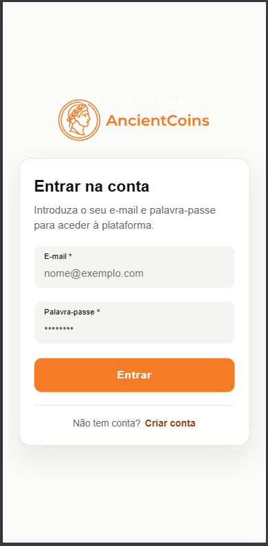
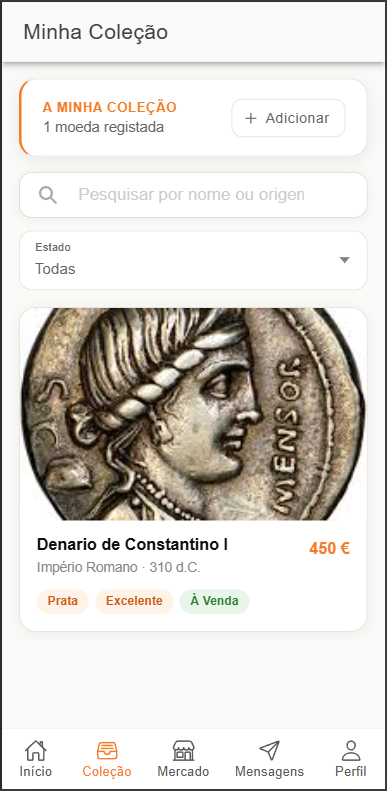
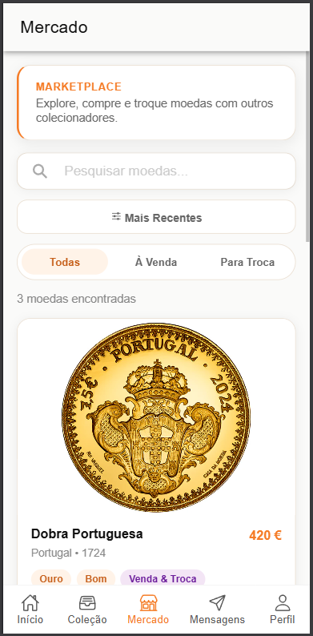
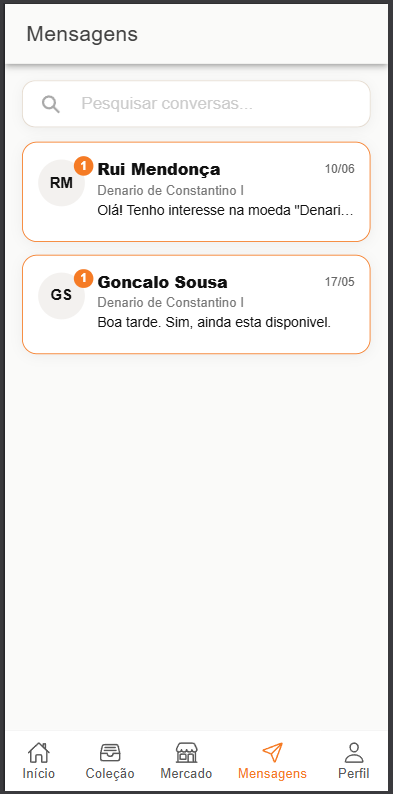
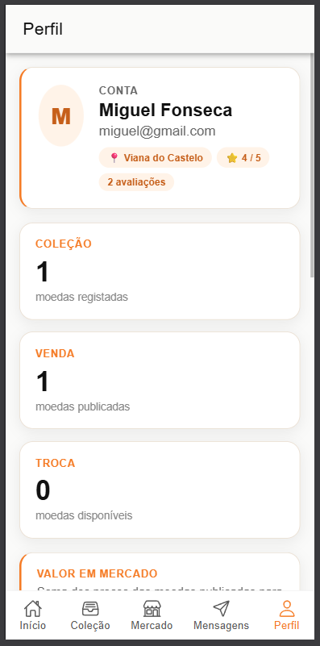
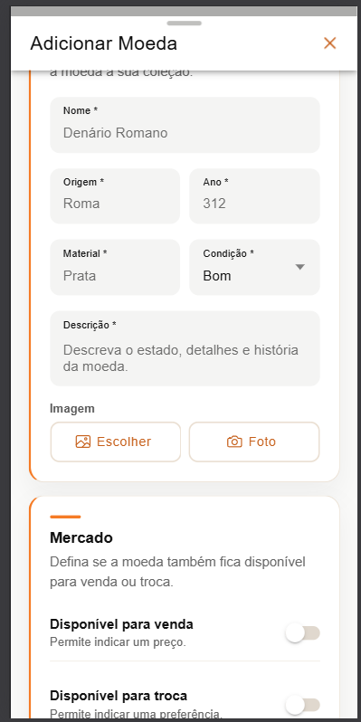
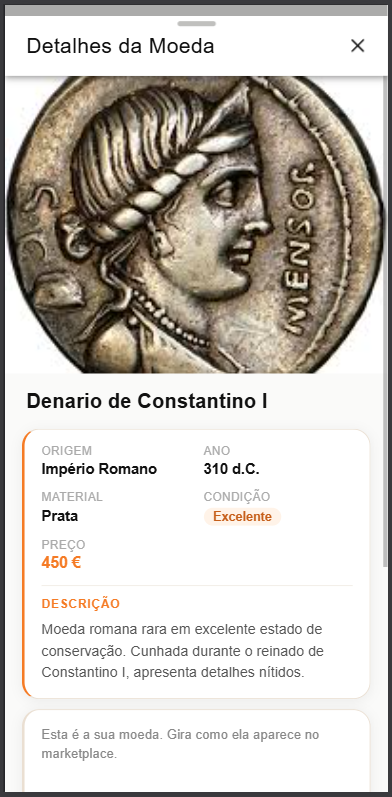
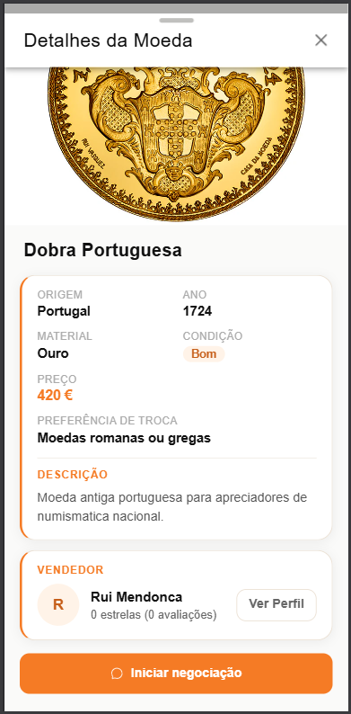

<div align="center">
  

  # AncientCoins

  **Aplicação móvel para gestão de coleções numismáticas, compra, venda, troca e comunicação entre colecionadores.**
</div>

## Sobre o Projeto

O **AncientCoins** é uma aplicação desenvolvida no âmbito da unidade curricular de **Interação Homem-Máquina**. O objetivo é oferecer uma plataforma simples e intuitiva para colecionadores de moedas registarem a sua coleção, explorarem moedas disponíveis no mercado, iniciarem negociações e acompanharem mensagens e avaliações de outros utilizadores.

A aplicação foi construída com **Ionic**, **Angular** e **Supabase**, combinando uma interface móvel responsiva com persistência de dados, autenticação e serviços organizados por domínio.

## Tecnologias

- Ionic Framework
- Angular
- TypeScript
- Supabase Auth, Database e Storage
- Capacitor
- SCSS
- Ionicons

## Galeria

<table>
  <tr>
    <td align="center">
      <br />
      <strong>Login</strong>
    </td>
    <td align="center">
      <br />
      <strong>Início</strong>
    </td>
    <td align="center">
      <br />
      <strong>Coleção</strong>
    </td>
  </tr>
  <tr>
    <td align="center">
      <br />
      <strong>Mercado</strong>
    </td>
    <td align="center">
      <br />
      <strong>Mensagens</strong>
    </td>
    <td align="center">
      <br />
      <strong>Perfil</strong>
    </td>
  </tr>
  <tr>
    <td align="center">
      <br />
      <strong>Adicionar Moeda</strong>
    </td>
    <td align="center">
      <br />
      <strong>Detalhe da Coleção</strong>
    </td>
    <td align="center">
      <br />
      <strong>Detalhe do Mercado</strong>
    </td>
  </tr>
</table>

## Funcionalidades

- Registo e autenticação de utilizadores.
- Proteção das áreas principais da aplicação através de guard de autenticação.
- Gestão da coleção pessoal de moedas.
- Adição e edição de moedas com dados como nome, origem, ano, material, condição, descrição e imagem.
- Upload de imagens para o Supabase Storage.
- Publicação de moedas para venda ou troca.
- Marketplace com pesquisa, filtros e ordenação.
- Consulta detalhada de moedas da coleção e do mercado.
- Sistema de mensagens associado a negociações.
- Avaliações de utilizadores.
- Perfil com estatísticas da conta, coleção, vendas e trocas.
- Interface móvel com navegação por tabs.
- Componentes e estilos reutilizáveis para manter consistência visual.

## Como Executar

```bash
npm install
npm start
```

Antes de executar, configura as variáveis de ambiente com as credenciais do Supabase, seguindo o exemplo em `.env.example`.

## Commits

O projeto utiliza a convenção **Conventional Commits** para manter o histórico de alterações consistente e fácil de interpretar.

Exemplos:

```bash
feat: add coin creation modal
fix: validate market price before saving
docs: update project report
refactor: centralize coin services
```

## Autores

- **Rui Mendonça** - 29738
- **Cristiano Fonseca** - 29725
- **Gonçalo Sousa** - 29726

## Repositório

[github.com/goncalojbsousa/ancient-coins](https://github.com/goncalojbsousa/ancient-coins)
